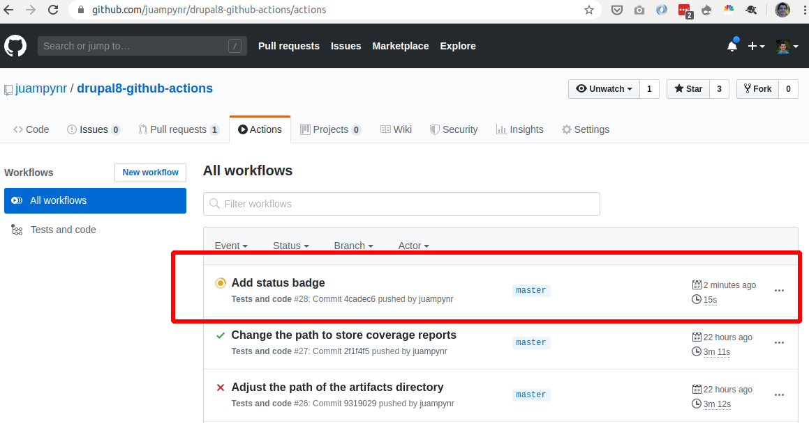

# Drupal 9 CI

[](https://circleci.com/gh/Lullabot/drupal9ci)

This repository provides the foundation to implement [Continuous Integration](https://en.wikipedia.org/wiki/Continuous_integration) in a Drupal 9
project using any of the following CI providers:

 * [CircleCI](#circleci)
 * [Travis CI](#travis-ci)
 * [GitLab CI](#gitlab-ci)
 * [GitHub Actions](#github-actions)

To install, simply run the respective installer and allow the CI provider that you chose to watch repository changes
to start building on every pull request.

If you want to test an individual module instead of a Drupal project, see Andrew Berry's
[drupal_tests](https://github.com/deviantintegral/drupal_tests).

Here is a clip that shows [how it works for CircleCI](https://www.youtube.com/watch?v=wd_5mX0x4K8).

## Requirements

The scripts assume that you have a Drupal 9 project created using [drupal-project](https://github.com/drupal-composer/drupal-project),
which sets a well known foundation. If your project's directory
structure differs from what _drupal-project_ sets up, you will need to
adjust the CI scripts.

It's also recommended to adjust your project to add a subset of the `settings.php` file into
version control and rely on `settings.local.php` for setting the database connection. See [this
commit](https://github.com/juampynr/drupal8-circleci/commit/817d0b6674c42dba73165b047b6b89d72ee72d11)
which contains these changes among other ones. The CI scripts have their own `settings.local.php`
which is copied at build time into `web/sites/default`.

## Installation

Each CI tool has its own installer, which extracts the required files to run the jobs. It also
adds a demo module with tests.

Choose a CI tool from the list below and follow its installation steps.

### [CircleCI](https://circleci.com)

[Demo repository](https://github.com/juampynr/drupal8-circleci) | [Deep dive article](https://www.lullabot.com/articles/continuous-integration-drupal-8-circleci)

Open a terminal and run the installer from the root of your project:
```bash
curl -L https://github.com/lullabot/drupal9ci/raw/master/setup-circleci.sh | bash
```

Sign up at [CircleCI](https://circleci.com/) and allow access to your project's repository.


Happy CI-ing! :-D. From now every time you create a pull request, CircleCI will run the
set of jobs and report their result like in the following screenshot:


For an overview of the CircleCI features, have a look at
[this article from the Lullabot blog](https://www.lullabot.com/articles/continuous-integration-drupal-8-circleci).

#### Using a custom Docker image

The [CircleCI configuration file](dist/circleci/.circleci/config.yml) uses a
[custom Docker image](https://hub.docker.com/r/juampynr/drupal8ci/) that extends from
the [official Drupal image](https://hub.docker.com/_/drupal/) and it is [hosted at
Docker Hub](https://hub.docker.com/r/juampynr/drupal8ci/). If this image
does not fit your project's architecture then consider [creating your own image](https://circleci.com/docs/2.0/custom-images/)
based out of it.


### [Travis CI](https://travis-ci.org)

[Demo repository](https://github.com/juampynr/drupal8-travis-ci) | [Deep dive article](https://www.lullabot.com/articles/continuous-integration-in-drupal-8-with-travis-ci)

Open a terminal and run the installer from the root of your project:
```bash
curl -L https://github.com/lullabot/drupal9ci/raw/master/setup-travis-ci.sh | bash
```

Sign up at [Travis CI](https://travis-ci.com/) and allow access to your project's repository:


Happy CI-ing! :-D. From now on every pull request will trigger a build in Travis and its
progress will be visible like in the following screenshot:


For you to see the result of the individual jobs, you need to click at the Details link
from the above screenshot:


#### Setting up code coverage reports

[Coveralls.io](https://coveralls.io/) is a third party tool that can host and present
PHPUnit code coverage reports in a neat way within a pull request. Here is how to set it up:

Register at https://coveralls.io using your GitHub account and then add your repository
like in the following screenshot:


Then take the chance to adjust a couple settings to get cleaner feedback in pull
requests:


That's it! Here is a sample report which you can see by clicking at Details
at the pull request's status message:


### [GitLab CI](https://about.gitlab.com/features/gitlab-ci-cd/)

[Demo repository](https://gitlab.com/juampynr/drupal8-gitlab) | [Deep dive article](https://www.lullabot.com/articles/installer-drupal-8-and-gitlab-ci)

Open a terminal and run the installer from the root of your project:
```bash
curl -L https://github.com/lullabot/drupal9ci/raw/master/setup-gitlab-ci.sh | bash
```

Review, commit, and push the resulting changes. After doing that, navigate to the project's homepage
at GitLab and open the CI / CD >> Pipelines section. You should see a running pipeline like
the following one:


### [GitHub Actions](https://github.com/features/actions)

[Demo repository](https://github.com/juampynr/drupal8-github-actions)

Open a terminal and run the installer from the root of your project:
```bash
curl -L https://github.com/lullabot/drupal9ci/raw/master/setup-github-actions.sh | bash
```

Review, commit, and push the resulting changes. After doing that, navigate to the repository's homepage
at GitHub and open the Actions tab. You should see a running workflow like the following one:




### Setting up the Behat and Cypress jobs for all platforms

The Behat and Cypress jobs require a running Drupal 9 site. The repository contains the code, but for running
tests in a realistic environment you need:

##### 1. A recent copy of the production environment's database

**Travis**
If you have Drush site aliases, and your repository is private, then follow these
instructions to [add an SSH key](https://docs.travis-ci.com/user/private-dependencies/#User-Key).
Next, set up a drush site alias. Finally, adjust the Behat job to run `drush @my.alias sql-cli`.

**CircleCI**
If you have Drush site aliases, then at the CircleCI dashboard go to the project's permissions
and add an SSH key. Next, add `drush @my.alias sql-cli` to the Behat job at `.circleci/config.yml`.

**Alternative**
Alternatively, upload a [sanitized](https://drushcommands.com/drush-8x/sql/sql-sanitize/) database
dump somewhere and set up the `DB_DUMP_URL` environment variable so the job can download it.

ie:


##### 2. The production environment's files directory

If you have a site alias, then add `drush rsync @my.alias @self` to the Behat job. Alternatively,
use [Stage File Proxy](https://www.drupal.org/project/stage_file_proxy) module.
